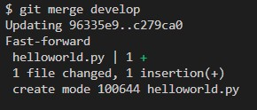
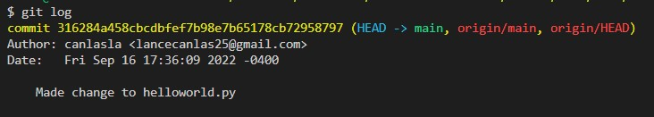
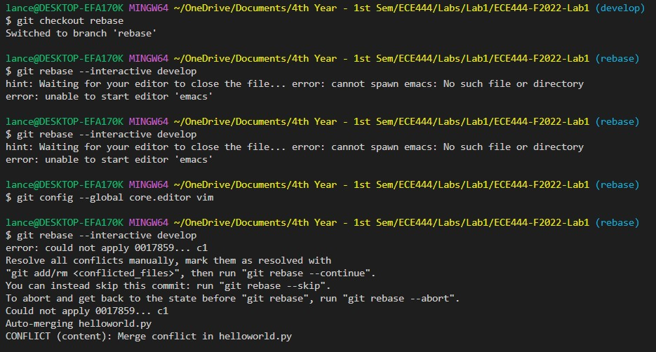
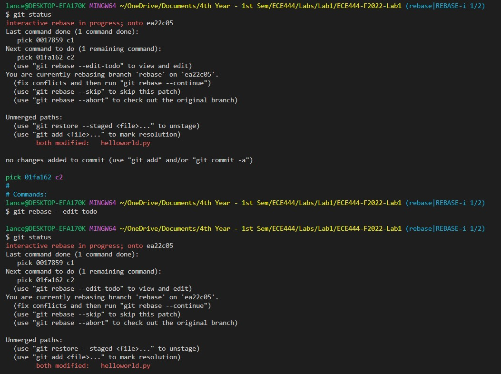
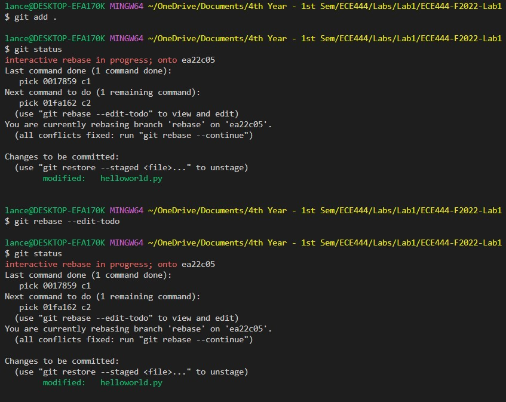
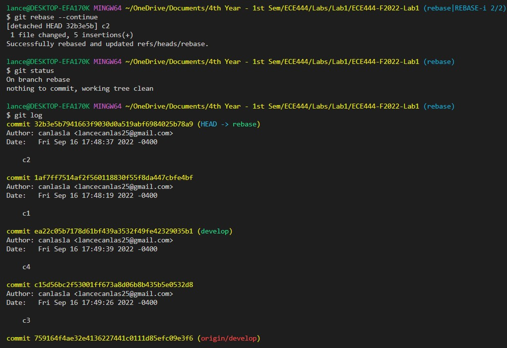
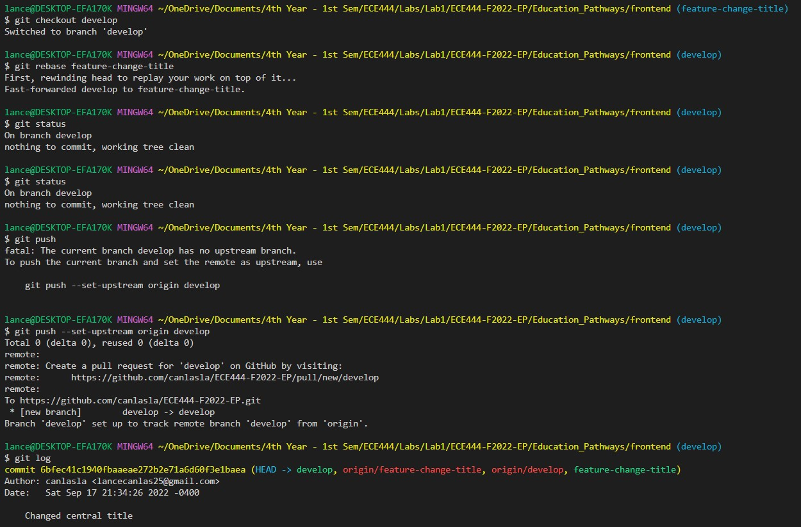

**Activity 1**

Lance Canlas

**Activity 2**

**Activity 3**

**Activity 4**

[Sean Llera's repository](https://github.com/ayshon/ECE444-F2022-Lab1)

**Activity 5**

So i realized i actually rebased the branch "develop" into the branch "rebase" initially. I fixed it afterwards, so the screenshots (Activity5a..d.jpg) are incorrect. I fixed it by rebasing the commits c4, c3, c1, c2 from the rebase branch into the develop branch. I could not include a screen shot of that though, my terminal history got wiped. Hope that makes sense.

**Activity 6**

[Lance's EP repo](https://github.com/canlasla/ECE444-F2022-EP)

**Activity 7**

**Activity 8**

